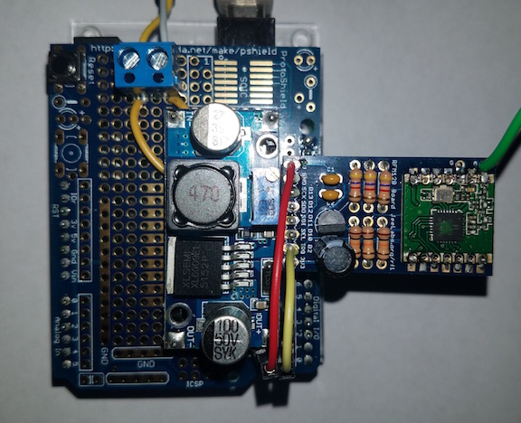

# emonMbus
Arduino firmware for a dedicated M-Bus master to submit "BTU" Heat Meter data to Emoncms

This project is not supported or endorsed by the [OpenEnergyMonitor project](https://github.com/openenergymonitor), but is obviously completely dependent on it and heavily based on the project's hardware and software. Thanks go out to those folks for their Open Source work.

Author: Bryan McLellan <btm@loftninjas.org>

## Hardware / Kit
Some assembly required...

- [Arduino Uno](https://store.arduino.cc/usa/arduino-uno-rev3)
- JeeLabs [RFM12B Board](https://jeelabs.net/projects/hardware/wiki/RFM12B_Board) with a 433/434 MHz  
  As far as I can tell, the [jeelib](https://github.com/jcw/jeelib) library does not support the RFM69HCW (high power) radio but does support the RFM69CW in compatibility mode as a replacement for the possibly deprecated RFM12B.
  You need a radio supported by jeelib to be able to transmit to an emonBase or emonPi. [Modern Devices](https://moderndevice.com/product/jeelabs-rfm12b-board-kit/) sells the board in the USA.
- OpenEnergyMonitor [m-bus master](https://github.com/openenergymonitor/HeatpumpMonitor/tree/master/Hardware/v4) circuit.  
  The circuit used in the OpenEnergyMonitor Heatpump Monitor was based off of Tomas Menzl's [libmbus design](https://github.com/rscada/libmbus/tree/master/hardware).
  The M-Bus master schematic can be best seen as the circuit in the lower right corner of the [Heatpump Monitor v4](https://raw.githubusercontent.com/openenergymonitor/HeatpumpMonitor/master/Hardware/v4/schematic.png) schematic.
  - D4 and D5 go to the corresponding digital pins on the Arduino
  - 1 and 2 of T9 go to the M-Bus connection of the meter which is polarity independent and does not need terminating resistors like Modbus.
  - The XL6009E1 step-up converter used in the OpenEnergyMonitor design can be acquired through [Addicore](https://www.addicore.com/XL6009E1-Boost-Converter-p/ad456.htm) and provides an adequate 36v that M-Bus desires when fed 5V from the Arduino. The original design and the M-Bus specification call for 36v, I don't know why the OpenEnergyMonitor project has 24v on it's schematic.
  - JP4 - JP7 on the schematic are risers for holding the XL6009E1 and aren't otherwise electrically important.  
  - I used a BC557 as a substitute for the BC307 transistor which wasn't readily available.
- Spire Metering Technologies [280T-S Ultrasonic Heat Meter](https://www.spiremt.com/ultrasonic-heat-meter-280t.html)  
  The Shenitech/SpireMT 280T appears to be an ancestor of the 280T-S and is likely compatible from the documentation I've seen.
  The meter is designed to measure consumption but the supply and return sensors can be swapped to measure production.

## Resources
- The Meter Bus (M-Bus) [documentation](http://www.m-bus.com/mbusdoc/default.php) is essential
- OpenEnergyMonitor Heatpump Monitor [build guide](https://github.com/openenergymonitor/HeatpumpMonitor/blob/master/heatpumpmonitor_build.md)
- The [MBUS Reader](https://github.com/openenergymonitor/HeatpumpMonitor/tree/master/Firmware/Arduino/MBUS_Reader) Arduino firmware is the best place to start to verify your M-Bus master circuit and poke at the meter. I learned a lot about the meter's data format this way.
- I have the SpireMT documentation for their M-Bus slave if you can't get it.

## Development
You'll need the [CustomSoftwareSerial](https://github.com/ledongthuc/CustomSoftwareSerial) and [jeelib](https://github.com/jcw/jeelib) libraries.

OpenEnergyMonitor has been exploring a number of hardware configurations to add an M-Bus master circuit to, from a emonPi replacement to an addon to the emonTx. I decided that this configuration was the best way I could produce firmware that someone else might make use of. There's some refactoring to do to support other meters, but contributions are welcome.

## License
The OpenEnergyMonitor firmware is licensed [GPLv3](LICENSE), and this is a derivative, so this is as well.

Copyright 2018, Bryan McLellan

---

